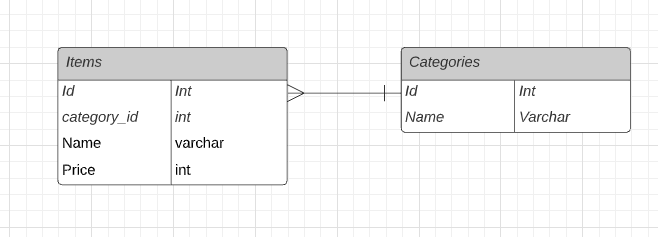

# Catalog Item API

REST API for CRUD Catalog Item

---

## Design Pattern

Design pattern that i use is implements SOLID Principle. With Creating Model, Form Request, Resource, Collection separatly. Which mean every part has own job dan responbility, prevent every part overlaping eachother, where it can make trouble when debuggin or developed by other developer. Example: with creating Form Request for validation, we don't need creating validation in Controller.

In this case i adding Service Layer for gather the logic method. Service Layer is useful if we have many controller with same logic to avoid redudancy and it can reduce number of code in Controller. For the error handling handled in `handler.php`.

---

## ERD

Categories table has one to many relation with Items table.

---

## Installation

1. Clone this repository
2. `cd catalog-app`
3. `composer install`
4. `cp .env.example .env`
5. `php artisan key:generate`
6. `php artisan migrate`
7. `docker compose up -d`
8. `php artisan serve`

## API Documentation

https://documenter.getpostman.com/view/13334944/UUy39mwg

---
